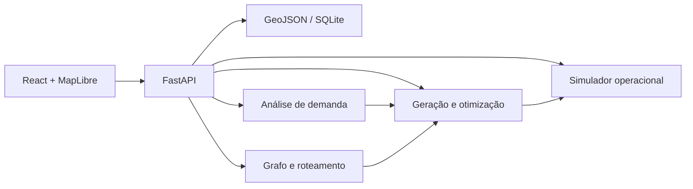

# Arquitetura do MVP

## Princípios

- Entregar um fluxo completo e demonstrável antes de perseguir precisão de planejamento real.
- Manter uma única aplicação backend modular; não usar microserviços.
- Priorizar resultados explicáveis: toda métrica deve expor premissas e componentes de cálculo.
- Usar dados locais e determinísticos para uma demonstração reproduzível.

## Componentes



### Frontend

Responsável exclusivamente por entrada, mapa, estado de interface e apresentação dos cenários. Não deve conter cálculo de demanda, custo, rotas ou regras de otimização.

Principais telas/componentes:

- Mapa com camadas para rede existente, POIs, zonas de demanda, estações candidatas e linhas propostas.
- Painel de filtros e pesos da função objetivo.
- Comparador de alternativas com custo, demanda, integrações e tempo economizado.
- Painel de simulação para frequência, capacidade e período analisado.

### Backend

FastAPI organiza endpoints e delega cálculos a serviços de domínio. Uma requisição de otimização deve retornar uma proposta autocontida, incluindo geometria, estações, métricas e premissas usadas.

### Dados

No início, GeoJSON é a fonte primária para entidades geográficas e SQLite pode guardar cenários salvos. A camada `repositories` é a única autorizada a conhecer o formato de armazenamento: isso permite substituir SQLite/GeoJSON por PostGIS posteriormente sem mudar a lógica de domínio.

## Modelo de domínio

| Entidade | Campos essenciais | Observação |
| --- | --- | --- |
| POI | id, nome, categoria, coordenada, peso_demanda | Exemplos: universidade, hospital, terminal. |
| Zona de demanda | id, geometria, população, empregos, demanda_base | Polígono ou centróide com peso. |
| Estação existente | id, nome, coordenada, linhas | Vértice de integração no grafo. |
| Trecho de rede | origem, destino, distância_km, tempo_min, linha | Aresta bidirecional, salvo exceção explícita. |
| Estação candidata | coordenada, demanda_coberta, integração, score | Resultado intermediário. |
| Linha proposta | estações ordenadas, geometria, métricas | Cenário a ser comparado e simulado. |
| Configuração operacional | headway, capacidade, velocidade, parada | Parâmetros da simulação. |

## Grafo e roteamento

A rede existente é um grafo ponderado: estações são nós e trechos são arestas. O peso principal é `tempo_min`; transferências recebem uma penalidade configurável para representar caminhada, espera e fricção de integração.

- **Rota de menor tempo:** Dijkstra do NetworkX.
- **Comparação antes/depois:** calcular o menor caminho no grafo-base e no grafo com a linha proposta temporariamente adicionada.
- **Trechos propostos:** no MVP, conectar estações ordenadas por uma geometria simplificada. O tempo deriva da distância e da velocidade comercial configurada.

Não é objetivo inicial representar todas as restrições físicas. Áreas proibidas, relevo e vias podem entrar depois como penalidades no custo de um segmento ou por busca A* sobre uma grade espacial.

## Demanda e polos

1. Agregar POIs e zonas de demanda em uma grade espacial ou clusters DBSCAN.
2. Transformar cada agrupamento em um polo com peso total de demanda.
3. Medir cobertura de cada estação candidata dentro de um raio de acesso configurável, inicialmente 800 m a 1 km.
4. Descontar parcialmente a demanda que já possui estação existente próxima.

Uma aproximação de contribuição de um ponto `i` para uma estação `s` é:

```text
contribuição(i, s) = peso_demanda(i) / (distância_km(i, s) + ε)²
```

O modelo deve retornar tanto a demanda total quanto as contribuições por categoria, para explicar o resultado ao usuário.

## Geração e otimização de estações

Estações candidatas surgem dos centróides de polos de demanda, eventualmente ajustados para pontos próximos a integrações da rede. Candidatos muito próximos entre si devem ser consolidados para evitar linhas com paradas redundantes.

Cada candidato recebe um score normalizado:

```text
score = 0,45 × demanda_atendida
      + 0,30 × tempo_economizado
      - 0,20 × custo_normalizado
      + 0,05 × integrações
```

Os pesos são parâmetros da requisição. Para manter o processamento rápido, usar uma heurística gulosa:

1. Ordenar candidatos pelo score.
2. Selecionar o melhor candidato ainda não coberto.
3. Remover ou penalizar candidatos a menos de uma distância mínima.
4. Repetir até atingir o número de estações solicitado.
5. Avaliar poucas ordens plausíveis das estações selecionadas e retornar as melhores alternativas.

Esse método é deliberadamente simples, previsível e demonstrável. Ele não garante ótimo global.

## Custos

O modelo de custo deve ser paramétrico e retornar uma decomposição legível:

```text
custo_total_brl =
  km_túnel × custo_km_túnel +
  km_elevado × custo_km_elevado +
  km_superfície × custo_km_superfície +
  estações × custo_por_estação +
  integrações × custo_por_integração +
  contingência
```

O cenário inicial pode adotar um único tipo de via para toda a linha. Todos os coeficientes devem ser fornecidos em uma configuração versionada, com ano-base informado ao frontend.

## Simulador operacional

Simulação discreta e agregada por intervalos de um minuto ou cinco minutos.

Entradas:

- demanda por estação e período;
- headway/frequência;
- capacidade por trem;
- velocidade comercial;
- tempo de parada;
- janela temporal.

Para cada intervalo, o simulador estima chegadas, embarques limitados pela capacidade, carga por trecho e fila remanescente. As saídas incluem passageiros atendidos, não atendidos, ocupação máxima, tempo médio de espera, capacidade por hora e gargalo do corredor.

## Contratos de API

Os endpoints usam JSON; geometrias seguem GeoJSON. A primeira versão não precisa de autenticação.

| Endpoint | Entrada resumida | Saída resumida |
| --- | --- | --- |
| `GET /network` | — | estações e trechos GeoJSON/JSON |
| `POST /demand/analyze` | POIs/zona, parâmetros de cluster | polos e demanda agregada |
| `POST /stations/generate` | polos, raio, limite de estações | candidatos com scores |
| `POST /lines/optimize` | candidatos, pesos, restrições | alternativas ordenadas |
| `POST /route/compare` | origem, destino, linha proposta | tempos antes/depois e rota |
| `POST /costs/estimate` | linha, parâmetros de custo | total e decomposição |
| `POST /simulation/run` | linha, demanda, configuração | métricas e série temporal |

## Estrutura recomendada

```text
backend/
└── app/
    ├── main.py
    ├── api/                  # Rotas e validação HTTP
    ├── models/               # Schemas Pydantic e entidades
    ├── services/             # Algoritmos e regras de domínio
    └── repositories/         # Acesso a GeoJSON/SQLite

frontend/
└── src/
    ├── components/           # Mapa, painéis e gráficos
    ├── pages/                # Fluxos/telas
    ├── services/             # Cliente da API
    └── types/                # Tipos TypeScript

data/                         # Dados pequenos e versionados de demonstração
docs/                         # Referências e decisões adicionais
```

## Limites e próximos passos

Antes de usar resultados fora do contexto de hackathon, validar dados, calibrar demanda com fontes reais, introduzir restrições territoriais e submeter cenários a especialistas de mobilidade e engenharia. Um caminho de evolução natural é trocar o repositório local por PostGIS e acrescentar uma camada de cenários persistidos.
